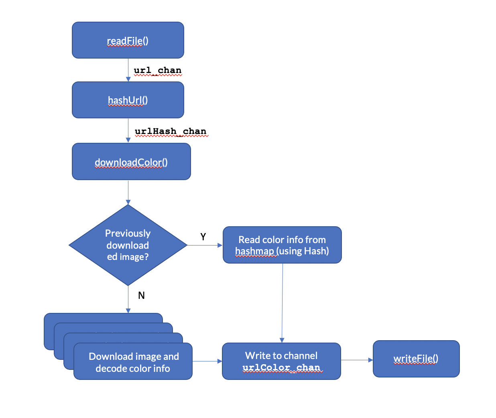

# Introduction
This github repo was created for a take-home challenge that has the following requirements:
* An input-file has a url to an image on each line
* Read each of those line, download the image and figure out the 3 most prevalent color in that image
* Write that data to an output file 
  * output format: `url,color,color,color`

Other points:
* The file can be much larger than memory available on the machine the script is run
* Processing time isn't a priority. The ability to process such a large file is the core requirement

 # Approach
 This problem can be broken down to a few steps:
 1. Read each URL from file
 1. Download image from URL
    - Before downloading Image, check in HashMap (populated in 3rd step). If present, proceed to 4th step
 1. Process Image:
    - Decode image and compute 3 most dominant colors
    - Store result in a HashMap
1. Write image result (`url,color,color,color`) to output-file

Given the scale of input data, this problem can be solved using concurrent processing techniques. I chose `Golang` for this reason as Golang provides rich primitives(channels, waitgroups etc) that can allow user to write a concurrent approach. I spent about a week to learn **Golang** and **Concurrent programming** - both of which were new to me!

# Code Outline

## readFile()
* Reads each line of URL from `input.txt`
* Publishes URL to Channel `url_chan`

## hashUrl()
* Computes Hash (MD5) of each URL. This is used to populate a HashMap that tracks if a URL was seen earlier. This reduces the load on hashmap in cases where the URL can be really long.
* Publish url and hash to Channel `urlHash_chan`

## downloadColor()
The function `downloadColor()` creates multiple instances of GoRoutine `downloader()` based on variable `numDownloaders`. Feel free to edit `numDownloaders` based on machine's capacity.

Check if url-hash exists in HashMap
* **YES**: publish url-color to Channel `urlColor_chan`
* **NO**:
    * Download Image (not stored on disk)
    * Decode image and compute 3 prevalent colors.
        * Publish url-color to Channel `urlColor_chan`
        * Store url-color in HashMap

## writeFile()
* Read from Channel `urlColor_chan` and write to `output.txt`

# Run / Install
There are no external packages used in this script.

A few ways to run script:

**Option 1**

    go run main.go

This assumes there's an input file by the name `input.txt` in the same level/folder as the script.

**Option 2**

    go run main.go <path-to-input-file>

**NOTE**: The script ALWAYS writes to `output.txt`

# Known Problems / Future Roadmap
Below are a few problems that exists in the current version of code. There's ample room to improve the current script.
* An error occurs after writing out Output file. Not sure why that's happening.
* Order in output file doesn't reflect the order of URLs in input file. This is because of asynchronous processing using Channels to communicate between various GoRoutines.
* Code can be organized better using Go Packages.